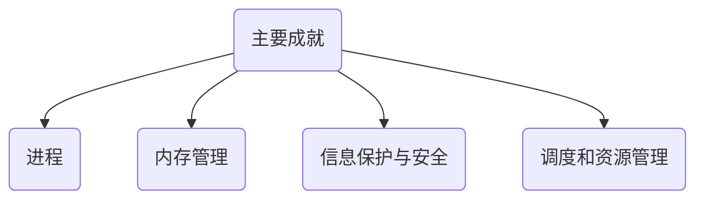
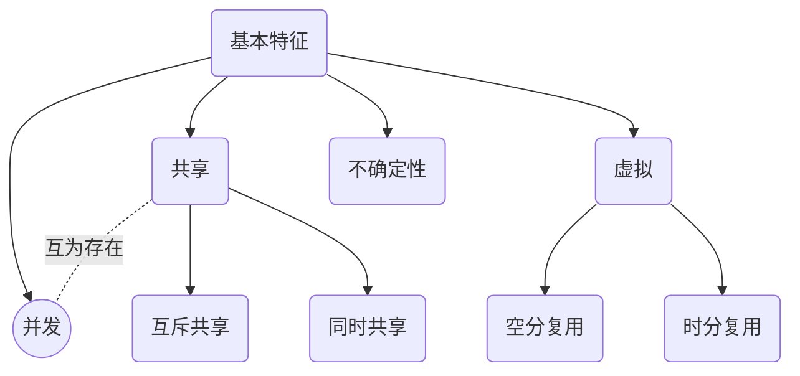

# 操作系统

> 丁旭阳             dxy@uestc.edu.com
>
> 课时： 56(理论)+8(实验)
> 10%(平时)+20%(实验)+10%(期中)+60%(期末)
>
> **参考书**
> William Stallings .操作系统——精髓与设计原理(8th)
> 刘乃琦，蒲晓蓉.操作系统原理、设计及应用
> 汤小丹，梁红兵等.操作系统原理(3rd)
>
> **参考视频**
>
> 2021王道操作系统   yutube
> 		讲义请见 [https://drive.google.com/open?id=12O...](https://www.youtue.com/redirect?q=https%3A%2F%2Fdrive.google.com%2Fopen%3Fid%3D12OrozW8oYz-nKL68o8YEAeRxmu8LG4&v=_8RfLggfRHc&redir_token=QUFFLUhqa2xPXy1FejFkX3o2NUo3MkZUTHZXSmpXNnhEUXxQ3Jtc0ttSjvcDhrNUFHRmVDQnGUDU1clN0Tk1zOVF1TTNCQldXN1lFcWVRRD6YS1kNGZqWjhiQ2hJMmo2djcyUEk1MURMWWFyRjhId0ZCV1FfTHhTZXUycDJUHlDX3RNdE9YS3vVJJRF9YQk52NlpLZw%3D%3D&event=video_description) 
> 		课件请见[https://drive.google.com/drive/folder...](https://www.youtue.com/redirect?q=https%3A%2F%2Fdrive.google.com%2Fdrive%2Ffolders%2F1TLYiSjCAOaFuj6p8qPkgUKejdvl_9MG6%3Fusp%3Dsharing&v=_8RfLggfRHc&redir_token=QUFFLUhqXKTU53aFQwOFN4TWZKdnpVaG4tWmluaVdXZ3xQ3Jtc0ttWXh6dTVkYTIQld6Zk84N2hMVUZsaHlsa0kwY0h0aXRCRGxkaWljkJaQTJxUM0VUFRWVY5eUVzRlVrN2Z4ZXZIR3RMUDVnTV9mczVON1dlS0plM0YwQy1uMEN2aE5UQ2NHNjM3M2SUtlNEFqYw%3D%3D&event=video_description)


[TOC]


## 1 KEY WORDS

###  1.1 Kernel & Core

Core 核心:  **是从整体对外使用的角度**   CPU 常用Core ，对外的一个整体

Kernel 内核: **是从形成整体定义的角度**    系统内核

> 部件之间协作时,core位于对外功能中心，属于中心部件，负责思考和计算。其它是外围部件，如存储，传输。如CPU,就用CORE表示内核。此时不关注core的内部结构，只考虑它的对外作用。
> 说有几个core,主要关注个数。表示量的变化。
> 		现实中对比AMD-CPU和INTEL-CPU时，已经关注CPU的内部结构了，不再用core,实际指的是kernel.
> 		core强调运行态。通常出现的core-down,是指cpu计算上出现问题了。
> 		core强调的是整体对外功能中的核心功能。
>
> 部件之间协作形成整体时,kernel位于形成整体的中心位置，它负责整体的本质定义，有点像种子。其它是衍生出的辅助部件，负责非本质的定义。如LINUX用kernel表示内核。此时关注它的内部结构，考虑它的内部结构所提供的本质定义。所以，不会说kernel-down说法。因为kernel强调设计态。
> 		kernel强调的是整体的本质定义。
> 		kernel不一定在空间中心。对水果种子,它是。对linux内核,它显然没有空间中心的几何形象。
>
> **core和kernel的紧密关系。**
>
> 在一个集体中,core通常要带领集体，形成整体能力。如果kernel限制core的发挥，难以应对现实，则core还要负责kernel的升级。
>
> 比如生产关系和生产力。生产关系决定了社会各要素的结构关系，生产要素的整体发挥出的能力就是生产力。生产关系定义了社会上所有生产活动的生产方式,即对同一刺激的反应，从而影响生产力。
>
> 在计算机中，kernel抽象化定义了各种部件及其关系,包括计算协调部件。CPU是kernel定义的抽象计算体的物理化实体。
>
> kernel如同生产关系,用OS物化，实际是OS的内核;core如同生产力,用CPU物化，但只负责计算协调,不负责kernel的升级定义。
>
> 不同OS,代表kernel不同。比如windows和linux。或linux中不同的流派，也是内核不同。只是此不同是在Linux范畴内。win系列，虽然都用win,还要看其内核是否相同。比如NT和win95。
>
> CPU则是AMD,INTEL,ARM等.甚至有GPU,忽视逻辑,专注计算。比如结构,指令集和流水线不同,导致本质也不同，展示了不等的能力或侧重。

### 1.2 作业、进程、任务、线程

作业：最早出现在批处理系统中，
指的是用户向系统提交的一项工作的基本单位，是用户在一次事务处理或计算过程中要求
计算机所做的工作的和

任务，简单的说就是用户要求计算机所做的一项工作，有时候进程也叫做任务
这是在多道系统中而言的

进程是程序的一次动态执行，是程序代码在内存中的一个映象，是程序代码对
数据结构的一次动态的操作过程！

线程，其实说到程序的最小执行单元就应该是线程了，线程是对CPU单元的独立占有的
最小单位，每个线程共享进程的数据，在每个进程被创建的时候只有一个主线程！

> 1、进程和线程的区别？
>
> ​     （1）进程是资源的分配和调度的一个独立单元，而线程是CPU调度的基本单元
>
> ​     （2）同一个进程中可以包括多个线程，并且线程共享整个进程的资源（寄存器、堆栈、上下文），一个进行至少包括一个线程。线程是进程的一部分，所以线程也被称为轻权进程或者轻量级进程
>
> ​     （3）进程的创建调用fork或者vfork，而线程的创建调用pthread_create，进程结束后它拥有的所有线程都将销毁，而线程的结束不会影响同个进程中的其他线程的结束
>
> ​     （4）线程是轻两级的进程，它的创建和销毁所需要的时间比进程小很多，所有操作系统中的执行功能都是创建线程去完成的
>
> ​     （5）线程中执行时一般都要进行同步和互斥，因为他们共享同一进程的所有资源
>
> ​     （6）线程有自己的私有属性TC，线程id，寄存器、硬件上下文，而进程也有自己的私有属性进程控制块PC，这些私有属性是不被共享的，用来标示一个进程或一个线程的标志
>
> **线程共享的环境包括：进程代码段、进程的公有数据(利用这些共享的数据，线程很容易的实现相互之间的通讯)、进程打开的文件描述符、信号的处理器、进程的当前目录和进程用户ID与进程组ID。**
>
>  
>
> 进程拥有这许多共性的同时，还拥有自己的个性。有了这些个性，线程才能实现并发性。这些个性包括：
>
>   1.线程ID
>    每个线程都有自己的线程ID，这个ID在本进程中是唯一的。进程用此来标识线程。
>
>   2寄存器组的值
>     由于线程间是并发运行的，每个线程有自己不同的运行线索，当从一个线程切换到另一个线程上 时，必须将原有的线程的寄存器集合的状态保存，以便将来该线程在被重新切换到时能得以恢复。
>
>   3.线程的堆栈
>     堆栈是保证线程独立运行所必须的。线程函数可以调用函数，而被调用函数中又是可以层层嵌套的，所以线程 必须拥有自己的函数堆栈， 使得函数调用可以正常执行，不受其他线程的影响。
>
>   4.错误返回码
>     由于同一个进程中有很多个线程在同时运行，可能某个线程进行系统调用后设置了errno值，而在该 线程还没有处理这个错误，另外一个线程就在此时被调度器投入运行，这样错误值就有可能被修改。所以，不同的线程应该拥有自己的错误返回码变量。
>   5.线程的信号屏蔽码
>     由于每个线程所感兴趣的信号不同，所以线程的信号屏蔽码应该由线程自己管理。但所有的线程都共享同样的信号处理器。
>   6.线程的优先级
>     由于线程需要像进程那样能够被调度，那么就必须要有可供调度使用的参数，这个参数就是线程的优先级。
>
>    涉及多线程程序涉及的时候经常会出现一些令人难以思议的事情，用堆和栈分配一个变量可能在以后的执行中产生意想不到的结果，而这个结果的表现就是内存的非法被访问，导致内存的内容被更改。 
>
> 理解这个现象的两个基本概念是：在一个进程的线程共享堆区，而进程中的线程各自维持自己堆栈。 
>
> 在 windows 等平台上，不同线程缺省使用同一个堆，所以用 C 的 malloc （或者 windows 的 GlobalAlloc）分配内存的时候是使用了同步保护的。如果没有同步保护，在两个线程同时执行内存操作的时候会产生竞争条件，可能导致堆内内存管理混乱。比如两个线程分配了统一块内存地址，空闲链表指针错误等。 
>
> Symbian 的线程一般使用独立的堆空间。这样每个线程可以直接在自己的堆里分配和释放，可以减少同步所引入的开销。当线程退出的时候，系统直接回收线程的堆空间，线程内没有释放的内存空间也不会造成进程内的内存泄漏。 
>
> 但是两个线程使用共用堆的时候，就必须用 critical section 或者 mutex 进行同步保护。否则程序崩溃时早晚的事。如果你的线程需要在共用堆上无规则的分配和释放任何数量和类型的对象，可以定制一个自己的 allcator，在 allocator 内部使用同步保护。线程直接使用这个 allocator 分配内存就可以了。这相当于实现自己的 malloc，free。但是更建议你重新审查一下自己的系统，因为这种情况大多数是不必要的。经过良好的设计，线程的本地堆应该能够满足大多数对象的需求。如果有某一类对象需要在共享堆上创建和共享，这种需求是比较合理的，可以在这个类的 new 和 delete 上实现共享保护。
>
> 


https://www.cnlogs.com/aquarius-ear/p/3939939.html

https://log.csdn.net/ThinkWon/article/details/102021274

###  1.3 进程&程序

进程是动态的，有生命周期
程序是静态的，存放在磁盘中一个可执行的文件

一个程序可对应多个进程（打开多个记事本）
一个进程可对应多个程序（PPT中插入视频）

就如同进程是人的灵魂，程序是人的肉体，没有灵魂的人为何叫人。

### 1.4 局部性原理

- 时间局部性

  在一个具有良好的时间局部性的程序中，被访问过一次的存储器位置很可能在不远的将来会被再次访问。

- 空间局部性

  在一个具有良好空间局部性的程序中，如果一个存储器位置被访问了一次，那么程序很可能在不远的将来访问附近的一个存储器位置。

应用：

- **硬件层**:高速缓存存储器(存储最近使用的指令)

- **操作系统**:虚拟地址空间的技术，以及缓存磁盘文件系统中最近被使用的磁盘块等都用到了局部性原理。

- **应用程序设计**:缓存思想。

### 1.5 并发&并行

并发：两个或多个事件在同一时间**间隔**内发生，宏观上是同时发生的，但微观上是交替发生的

并行：两个或多个事件在同一**时刻**发生

单核一次只能运行一个程序，多核可以并行运行多个程序

### 1.6 WIN & LINUX & UNIX


## 2 操作系统概述

==操作系统是一组控制和管理计算机硬件和软件资源，合理地对各类作业进行调度，以方便用户使用的**程序集合**==


计算机的概念回答了计算机是什么？计算的目标和功能回答了它能干什么？


<table>
    <tr>
        <td>
            
        </td>
        <td>
            
        </td>
    </tr>
</table>


```mermaid
graph T
id(操作系统)-->id1(内存管理)
id-->id2(处理机管理)
id-->id3(作业管理)
id-->id4(I/O管理)
id-->id5(文件管理)

```


### 2.1 目标

- 方便
- 有效
- 易扩展性

### 2.2 发展史


#### 2.2.1 串行处理


#### 2.2.2简单批处理系统


**监控程序就是操作系统的雏形**


- 内存保护
  - 用户程序以==用户模式==运行
  - 监控程序以==内核模式==运行

但是处理器还是处于空闲状态，引入多道程序设计技术，当一个作业需要等待I / O时，处理器可以切换到另一个作业

#### 2.2.3 多道批处理系统


- 优点：
  - 多道程序并发，共享电脑资源。使得CPU的利用率上升。
- 缺点
  - 由于一次性放入多个程序，从而缺乏交互能力。eg:无法调试程序。

- 内存管理
- 调度算法

#### 2.2.4 分时系统

主要解决人机交互问题，但是不能优先处理一些紧急任务。


- CTSS（Compatile Time-Sharing System）第一个分时操作系统
  - 

- ==时间片==

##### 批处理与分时比较

|                | 批处理系统多道程序设计           | 分时           |
| -------------- | -------------------------------- | -------------- |
| 主要目标       | 充分利用处理器                   | 减小响应时间   |
| 操作系统指令源 | 作业控制语言命令  作业提供的命令 | 终端键入的命令 |


#### 2.2.5 实时系统

解决紧急任务优先执行的


### 2.3 主要成就



#### 2.3.1 进程

- 组成部分
  - 一段可执行的程序
  - 程序所需要的相关数据(变量、工作空间、缓冲区等)
  - 程序的执行上下文(**根本**)

> 执行上下文(execution context)又称进程状态(process state),是操作系统用来**管理**和**控制**进程所需要的**内部数据**

#### 2.3.2 内存管理

- 存储管理的任务
  - 进程**隔离**：每个进程拥有独立的地址空间，互不干扰
  - **自动分配**和管理：动态分配，对程序员透明
  - 支持**模块化**程序设计：能够动态加载、销毁程序员定义的模块
  - **保护**和访问控制：一个应用程序不能任意访问其它程序的存储空间
  - **长期存储**：关机后仍能长时间存储信息
- 存储管理的实现方式
  - **文件系统** **+** **虚拟存储**
- 文件系统
  - 实现了长期存储
  - 文件
    - 一个有名称的对象
    - 访问控制和保护的基本单元
- 虚拟存储
  - 程序以**逻辑方式**访问存储器
  - **多作业**同时驻留内存
  - 每个作业**部分**驻留
  - **换入**、**换出**机制

- 分页机制
  - 进程由若干个**固定大小**的块组成——页
  - 虚地址（virtual address）由**页号**和**页内偏移量**组成
  - 进程中的每一页均可置于内存中任何位置
  - 提供了虚地址和实地址（real address）之间的**动态映射**机制

#### 2.3.3 信息保护与安全

- **可用性**：保护系统不被中断

- **机密性**：保证用户不能读取未授权访问的数据
- **完整性**：保护数据不被未授权修改
- **认证**： 涉及用户身份的正确认证和消息或数据的合法性

#### 2.3.4 调度和资源管理

- **公平性**
  - 所有进程享有同等和公平的资源访问机会
- 有**差别**的响应性
  - 区分进程类型且可动态调整
- **有效性**
  - 折中处理矛盾需求

### 2.4 基本特征



共享和并发互为存在：
        没有并发，共享就没有意义
        没有共享就无法并发

#### 2.4.1 共享 sharing

 概念：系统中的资源可供内存中多个并发执行的进程**共同**使用。

 共享资源类型

 - 临界资源：在**一段时间**内，只允许一个进程访问

 - 非临界资源：在**一段时间**内，允许多个进程访问

 共享方式

 - 互斥共享方式
    - 对临界资源的访问，如打印机
 - 同时访问方式
      - 对非临界资源的访问，如磁盘，宏观上是同时，微观上是交替访问(即分时访问)

#### 2.4.2 不确定性non-determinism

不确定性（异步性）
- 在多道程序环境下，程序**执行过程**的不确定性
  - 何时执行
  - 执行顺序
  - 完成运行所需时间

通常而言，**操作系统的不确定性是指异步性，而非程序执行结果的不确定性**。 

#### 2.4.3 虚拟 virtualization

虚拟：通过某种技术把一个物理实体变为若干个**逻辑**上的对应物。

实现方式

​		–时分复用技术

​				Ø 虚拟处理机

​				Ø 虚拟设备，如打印机（SPOOLING技术）

​		–空分复用技术

​				Ø 虚拟磁盘

​				Ø 虚拟内存

#### 2.4.4 并发concurrency

并发：两个或多个事件在同一时间**间隔**内发生

并行：两个或多个事件在同一**时刻**发生

程序：静态实体，无法并发

进程：动态实体，可并发执行

- 单处理机系统：进程可并发执行，无法并行执行

- 多处理机系统：进程既可并发执行，又可并行执行

并发性： 在多道程序环境下，在一段时间内，有多个任务同时运行

优点：让CPU、I/O设备并行工作，提高资源利用率。


### 2.5 体系结构


#### 2.5.1 模块化结构

按功能划分成若干个模块，模块之间通过接口实现交互

- 模块独立性衡量标准
  - 内聚性：模块内部各部分间联系的紧密程度(==越高越好==)
  - 耦合度：模块间相互联系和相互影响的程度(==越低越好==)

- 优点
  - OS设计的正确性高，易于理解和维护(只需维护各个模块)
- 缺点
  - 接口难以定义
  - 模块之间存在复杂的依赖关系(难以抽象出独立的模块)

#### 2.5.2分层式结构

> Any Prolem in computer science can e solved y another **layer** of indirection

按功能流图的调用顺序等原则划分为若干层，每层只能使用其直接下层所提供的服务，每层对其上层隐藏其下各层的存在(==单向依赖关系==)

- 优点
  - 易保证系统的正确性
  - 易于理解和维护
  - 易于扩充
- 缺点
  - 系统效率较低

#### 2.5.3 微内核结构

> 思想
>
> > 在操作系统内核中只留下一些**最基本**的功能，而将其它服务尽可能地从内核中分离出去，用若干个运行在用户态的服务器进程来实现，形成“**客户/服务器模式**”。普通用户进程通过内核向服务器进程发送请求


- 优点
  - 提高了系统的可扩展性
  - 增强了系统的可靠性
  - 可移植性好
  - 提供了对==分布式系统==的支持
- 缺点
  - 运行效率有所降低：==消息传递开销+模式切换开销==

机制与策略
      机制：实现某一功能的具体执行机构——怎么做
      策略：方法或原则，用以优化功能实现——做什么
机制与策略的分离
           如基于优先级的进程调度中，选择进程，为之分配处理机，使之运行属于机制部分；而为每个进程设定优先级则属于策略部分。

- 微内核的基本功能
  - 进程管理
  - 低级存储器管理
  - 中断和陷入处理

##### 大内核VS微内核


进程管理、存储管理、设备管理其实就是数据结构的维护管理

时钟管理、中断处理、原语是直接与硬件接触的　

变态这里是为了方便性，考试时应该写成**状态转换**


典型的大内核/宏内核/单内核 操作系统： Linux、 UNIX
典型的 微内核 操作系统： Windows NT  

### 2.6 运行机制

程序最终的执行是有编译器编译成多条机器指令，然后由CPU执行一条一条的机器指令的过程。

​              

首先说明一下本文中所指的指令是处理器(CPU)能够识别、处理的最基本的指令，**是二进制机器指令**。
而Linux终端和win的CMD中的“指令”是“交互式命令接口”。

特权指令就是只能由内核能执行的指令，此时的状态为内核态。

#### 2.6.1 特权指令VS非特权指令

**特权指令**：只能由操作系统使用、用户程序不能使用的指令。 举例：启动I/O、内存清零、修改程序状态字 、设置时钟 、允许/禁止终端 停机

**非特权指令**：用户程序可以使用的指令。 举例：控制转移、算数运算、 取数指令、 **访管指令**（使用户程序从用户态陷入内核态）

#### 2.6.2 内核程序VS用户程序

用户程序：常用的QQ、Chrome等等

内核程序：实现操作系统内核功能的那些程序就是内核程序。 这个的角色就是这个系统资源的管理者

#### 2.6.3 内核态VS用户态

> WHY?
>
> 什么会有两个态？
>
> > 由于需要限制不同的程序之间的访问能力, 防止他们获取别的程序的内存数据, 或者获取外围设备的数据, 并发送到网络, CPU划分出两个权限等级 -- 用户态和内核态。


内核态与用户态是操作系统的两种运行级别，当程序运行在Ring 3级特权级上时，就可以称之为运行在用户态。**因为这是最低特权级，是普通的用户进程运行的特权级，大部分用户直接面对的程序都是运行在用户态；**

当程序运行在Ring 0级特权级上时，就可以称之为运行在内核态。

运行在用户态下的程序不能直接访问操作系统内核数据结构和程序。当我们在系统中执行一个程序时，大部分时间是运行在用户态下的，在其需要操作系统帮助完成某些它没有权力和能力完成的工作时就会切换到内核态（比如操作硬件）。

> - 这两种状态的主要差别是
>   - 处于用户态执行时，进程所能访问的内存空间和对象**受到限制**，其所处于占有的处理器是**可被抢占的**
>   - 处于内核态执行时，则能访问**所有**的内存空间和对象，且所占有的处理器是**不允许被抢占的**。

==状态切换==

**用户态--->内核态：**唯一途径是通过中断、异常、陷入机制（访管指令）

**内核态--->用户态：**设置程序状态字PSW

> - 系统调用
>
> **这是用户态进程主动要求切换到内核态的一种方式**，**用户态进程通过系统调用申请使用操作系统提供的服务程序完成工作。**比如fork()实际上就是执行了一个创建新进程的系统调用。
>
> 而系统调用的机制其核心还是使用了操作系统为用户特别开放的一个中断来实现，例如Linux的int 80h中断。
>
> 用户程序通常调用库函数，由库函数再调用系统调用，因此有的库函数会使用户程序进入内核态（只要库函数中某处调用了系统调用），有的则不会。
>
> - 异常
>
> 当CPU在执行运行在用户态下的程序时，发生了某些事先不可知的异常，这时会触发由当前运行进程切换到处理此异常的内核相关程序中，也就转到了内核态，比如缺页异常。
>
> - 外围设备的中断
>
> **当外围设备完成用户请求的操作后，会向CPU发出相应的中断信号**，这时CPU会暂停执行下一条即将要执行的指令转而去执行与中断信号对应的处理程序，
>
> 如果先前执行的指令是用户态下的程序，那么这个转换的过程自然也就发生了由用户态到内核态的切换。比如硬盘读写操作完成，系统会切换到硬盘读写的中断处理程序中执行后续操作等。
>
> **这3种方式是系统在运行时由用户态转到内核态的最主要方式，其中系统调用可以认为是用户进程主动发起的，异常和外围设备中断则是被动的。**

参考：[用户态和内核态的区别](https://www.cnlogs.com/gizing/p/10925286.html)
	      [用户态和内核态](https://www.cnlogs.com/maxigang/p/9041080.html)   推荐，有例子

### 2.7 中断

中断：就是将用户态转为内核态的唯一途径。夺回操作系统对资源的控制


- 类型
  - 内中断Synchronous interrupts
    - 与当前执行的指令有关，中断信号的来源CPU内部
  - 外中断Asynchronous interrup
    - 与当前执行的指令无关，中断信号来源与CPU外部

>内中断：
>　EX1：用户程序里有黑客植入的一条特权指令，但CPU又处于用户态，引发中断信号
>
>​	EX2：用户程序想请求内核的服务，此时会执行特殊的指令——陷入指令(Trap Instruction)，引发中断信号。系统调用就是通过这个指令来实现的，该指令不是特权指令，因为可以在用户态下运行。
>
>​	如非法操作码、地址越界、浮点溢出等
>
>外中断：
>
>​	EX1：时钟中断——由时钟部件发送中断信号。
>
>
>
>​	EX2：I/O中断：硬盘读写服务请求中断

#### 中断机制的基本原理

不同的中断信号， 需要用不同的中断处理程序来处理。 当CPU检测到中断信号后， 会根据中断信号的类型去查询“**中断向量表**” ， 以此来找到相应的**中断处理程序**在内存中的存放位置。  

中断处理程序显然是内核程序，因为只能在内核态下才能运行它。

具体的硬件实现是计算机组成的内容。


相关推荐：[CPU中断的工作原理](https://www.cnlogs.com/niuyourou/p/11907858.html)

> 中断（异常）处理过程
>
> https://www.cnlogs.com/aaronLinux/p/10842499.html
>
> 
>
> 
>
>  
>
>   需要明确的一点是CPU对于**中断和异常的具体处理机制本质上是完全一致的**，即：
>
> 当CPU收到中断或者异常的信号时，它会暂停执行当前的程序或任务，通过一定的机制跳转到负责处理这个信号的相关处理程序中，在完成对这个信号的处理后再跳回到刚才被打断的程序或任务中。这里只描述保护模式下的处理过程，搞清楚了保护模式下的处理过程（更复杂），实模式下的处理机制也就容易理解了。
>
>  
>
> 具体的处理过程如下：
>
> 1) 中断响应的事前准备：
>
> 　　系统要想能够应对各种不同的中断信号，总的来看就是需要知道每种信号应该由哪个中断服务程序负责以及这些中断服务程序具体是如何工作的。系统只有事前对这两件事都知道得很清楚，才能正确地响应各种中断信号和异常。
>
> 1. 系统将所有的中断信号统一进行了编号（一共256个：0～255），这个号称为中断向量，具体哪个中断向量表示哪种中断有的是规定好的，也有的是在给定范围内自行设定的。 中断向量和中断服务程序的对应关系主要是由IDT（中断向量表）负责。操作系统在IDT中设置好各种中断向量对应的中断描述符（一共有三类中断门描述符：任务门、中断门和陷阱门），留待CPU查询使用。而IDT本身的位置是由idtr保存的，当然这个地址也是由OS填充的。
> 2. 中断服务程序具体负责处理中断（异常）的代码是由软件，也就是操作系统实现的，这部分代码属于操作系统内核代码。也就是说从CPU检测中断信号到加载中断服务程序以及从中断服务程序中恢复执行被暂停的程序，这个流程基本上是硬件确定下来的，而具体的中断向量和服务程序的对应关系设置和中断服务程序的内容是由操作系统确定的。
>
> 2) CPU检查是否有中断/异常信号
>
>  　　CPU在执行完当前程序的每一条指令后，都会去确认在执行刚才的指令过程中中断控制器（如：8259A）是否发送中断请求过来，如果有那么CPU就会在相应的时钟脉冲到来时从总线上读取中断请求对应的中断向量[2]。
>
> 对于异常和系统调用那样的软中断，因为中断向量是直接给出的，所以和通过IRQ（中断请求）线发送的硬件中断请求不同，不会再专门去取其对应的中断向量。
>
> 3) 根据中断向量到IDT表中取得处理这个向量的中断程序的段选择符
>
> 　　CPU根据得到的中断向量到IDT表里找到该向量对应的中断描述符，中断描述符里保存着中断服务程序的段选择符。
>
> 4) 根据取得的段选择符到GDT中找相应的段描述符
>
> 　　CPU使用IDT查到的中断服务程序的段选择符从GDT中取得相应的段描述符，段描述符里保存了中断服务程序的段基址和属性信息，此时CPU就得到了中断服务程序的起始地址。这里，CPU会根据当前cs寄存器里的CPL和GDT的段描述符的DPL，以确保中断服务程序是高于当前程序的，如果这次中断是编程异常（如：int 80h系统调用），那么还要检查CPL和IDT表中中断描述符的DPL，以保证当前程序有权限使用中断服务程序，这可以避免用户应用程序访问特殊的陷阱门和中断门[3]。
>
> 5) CPU根据特权级的判断设定即将运行的中断服务程序要使用的栈的地址
>
> 　　CPU会根据CPL和中断服务程序段描述符的DPL信息确认是否发生了特权级的转换，比如当前程序正运行在用户态，而中断程序是运行在内核态的，则意味着发生了特权级的转换，这时CPU会从当前程序的TSS信息（该信息在内存中的首地址存在TR寄存器中）里取得该程序的内核栈地址，即包括ss和esp的值，并立即将系统当前使用的栈切换成新的栈。这个栈就是即将运行的中断服务程序要使用的栈。紧接着就将当前程序使用的**ss,esp**压到新栈中保存起来。也就说比如当前在某个函数中，使用的栈，在中断发生时，需要切换新的栈。
>
> 6) 保护当前程序的现场
>
> 　　CPU开始利用栈保护被暂停执行的程序的现场：依次压入当前程序使用的eflags，cs，eip，errorCode（如果是有错误码的异常）信息。
>
> 官方文档[1]给出的栈变化的示意图如下：
>
> 7) 跳转到中断服务程序的第一条指令开始执行
>
> 　　CPU利用中断服务程序的段描述符将其第一条指令的地址加载到cs和eip寄存器中，开始执行中断服务程序。这意味着先前的程序被暂停执行，中断服务程序正式开始工作。
>
> 8) 中断服务程序处理完毕，恢复执行先前中断的程序
>
> 　　在每个中断服务程序的最后，必须有中断完成返回先前程序的指令，这就是iret（或iretd）。程序执行这条返回指令时，会从栈里弹出先前保存的被暂停程序的现场信息，**即eflags,cs,eip**重新开始执行。

### 2.8 系统调用

上节中提到系统调用是通过中断来实现的(通过内中断中的Trap指令来实现)

知识点回顾：操作系统作为用户和计算机硬件之间的接口， 需要向上提供一些简单易用的服务。 主要包括命令接口和程序接口。 其中， 程序接口由一组系统调用组成。  

“系统调用” 是操作系统提供给应用程序（程序员/编程人员） 使用的接口， 可以**理解为一种可供应用
程序调用的特殊函数， 应用程序可以通过系统调用来请求获得操作系统内核的服务**  


<table>
    <tr>
        <td>
            
        </td>
        <td>
            
        </td>
    </tr>
</table>


库函数的调用是语言或者应用程序的一部分，而系统调用则是操作系统的一部分。

**普通应用程序**: 可直接进行系统调用， 也可使用库函数。有的库函数涉及系统调用(创建新文件)， 有的不涉及(加法计算)
**编程语言**: 向上提供库函数。 有时会将系统调用封装成库函数， 以隐藏系统调用的一些细节，使程序员编程更加方便。
**操作系统**: 向上提供系统调用， 使得上层程序能请求内核的服务  

>  WHY？
> 为什么会出现系统调用？
>
> > **因为资源是有限的。**需要一个东西来进行管理，所以就让系统来管理共享的资源，用户程序要使用该资源时，就需要就进行系统调用，来使用该资源。
>
> 系统调用最终还是会由内核函数完成，那么为什么不直接调用内核函数呢？
>
> > 这是因为**用户空间的程序无法直接执行内核代码**，因为内核驻留在受保护的地址空间上，不允许用户进程在内核地址空间上读写。所以，应用程序 会以某种方式通知系统，告诉内核需要执行一个函数调用，这种通知机制是靠**软中断**来实现的，通过**引发一个异常来促使系统切换到内核态去执行异常处理程序**。此时的异常处理程序就是所谓的系统调用处理程序。
>
> 什么功能会用到系统调用？
>
> > 应用程序通过系统调用请求操作系统的服务。 而系统中的各种共享资源都由操作系统内核统一掌管， 因此凡是与共享资源有关的操作（如存储分配、 I/O操作、 文件管理等） ， 都必须通过系统调用的方式向操作系统内核提出服务请求， 由操作系统内核代为完成。 这样可以**保证系统的稳定性和安全性， 防止用户进行非法操作**。  
>
> 

系统调用过程


传递系统调用参数 -》 执行陷入指令（用户态）-》执行相应的内请求核程序处理系统调用（核心态）-》返回应用程序(就是中断的过程)

注意： 

1. 陷入指令是在用户态执行的， 执行陷入指令之后立即引发一个内中断， 使CPU进入核心态

2. 发出系统调用请求是在用户态， 而对系统调用的相应处理在核心态下进行  

参考资料：[什么是系统调用，系统调用的过程](http://c.iancheng.net/view/1195.html)

​					[操作系统--系统调用](https://www.jianshu.com/p/8e8913fac7d)

​					[系统调用的概念及原理](https://log.csdn.net/qq_43646576/article/details/102841078)     ==推荐==

> ​		在讨论操作系统如何提供系统调用之前，首先通过例子来看看如何使用系统调用：编写一个简单程序，从一个文件读取数据并复制到另一个文件。程序首先需要输入两个文件名称：输入文件名称和输出文件名称。这些名称有许多不同的给定方法，这取决于操作系统设计。
>
> ​		一种方法是，让程序询问用户这两个文件名称。对于交互系统，该方法包括一系列的系统调用：先在屏幕上输出提示信息，再从键盘上读取定义两个文件名称的字符。对于基于鼠标和图标的系统，一个文件名称的菜单通常显示在窗口内。用户通过鼠标选择源文件名称，另一个类似窗口可以用来选择目的文件名称。这个过程需要许多 I/O 系统调用。
>
> ​		在得到两个文件名称后，该程序打开输入文件并创建输出文件。每个操作都需要一个系统调用。每个操作都有可能遇到错误情况，进而可能需要其他系统调用。
>
> ​		例如，当程序设法打开输入文件时，它可能发现该文件不存在或者该文件受保护而不能访问。在这些情况下，程序应在控制台上打印出消息（另一系列系统调用），并且非正常地终止（另一个系统调用）。如果输入文件存在，那么必须创建输出文件。可能发现具有同一名称的输出文件已存在。这种情况可以导致程序中止（一个系统调用），或者可以删除现有文件（另一个系统调用）并创建新的文件（另一个系统调用）。对于交互系统，另一选择是询问用户（一系列的系统调用以输出提示信息并从控制台读人响应）是否需要替代现有文件或中止程序。
>
> ​		现在两个文件已设置好，可进入循环，以读取输入文件（一个系统调用），并写到输出文件（另一个系统调用）。每个读和写都应返回一些关于各种可能错误的状态信息。对于输入，程序可能发现已经到达文件的结束，或者在读过程中发生了硬件故障（如奇偶检验错误）。对写操作，也可能出现各种错误，这取决于输出设备（例如，没有磁盘空间）。
>
> ​		最后，在复制了整个文件后，程序可以关闭两个文件（另一个系统调用），在控制台或视窗上写一个消息（更多系统调用），最后正常结束（最后一个系统调用）。图 1 显示了这个系统调用序列。
>
> ​								
> ​															图 1 如何使用系统调用的例子

## 3 进程管理

并发是现代操作系统最重要的特征之一

进程操作系统最重要的抽象概念之一

并发基于进程，进程抽象出来的原因就是为了并发

### 3.1基本概念


#### 3.1.1 进程的组成


这里严格来说应该是进程实体的组成，有了进程实体的概念后，进程就可以定义为进程是进程实体的运行过程， 是系统进行**资源分配**和**调度**的一个独立单位。  

调度：指系统让进程在处理器上运行。

角度不同

==PCB是给操作系统用的。用于管理进程
程序段、 数据段是给进程自己用的。==  

#### 3.1.2 进程控制块PCB

> **用来描述和控制进程的运行的一个数据结构**——进程控制块PC(Process Control Block)，是进程实体的一部分，是操作系统中最重要的记录型数据结构。
>
> PCB是进程存在的**唯一标志**,当进程被创建时， 操作系统为其创建PCB， 当进程结束时， 会回收其PCB。
>
> 系统能且只能通过PCB对进程进行控制和调度
>
> PCB记录了操作系统所需的、用于描述进程的当前情况以及控制进程运行的全部信息


##### PCB中的信息


-  1 **进程标识符*Process Identifier***
  - 进程标识符用于唯一地标识一个进程。
  - 一个进程通常有两种标识符：
    - **内部标识符**：在所有的操作系统中，都为每一个进程赋予了一个惟一的数字标识符，它通常是一个进程的序号。设置内部标识符主要是为了方便系统使用。
    - **外部标识符**：它由创建者提供，通常是由字母、数字组成，往往是由用户(进程)在访问该进程时使用。为了描述进程的家族关系，还应设置父进程标识及子进程标识。此外，还可设置用户标识，以指示拥有该进程的用户。
- 2 **处理机状态**
  - 处理机状态信息主要是由处理机的各种寄存器中的内容组成的。
  - 包括：① 通用寄存器；② 指令计数器；③ 程序状态字PSW；④ 用户栈指针。
  - 这些信息显然和进程相关，因此，进程一旦被中断，就必须把这些信息保存在PC中，以便在恢复运行时能完全恢复中断前的状态。
- 3 **进程(调度)控制和管理信息**
  - 在PC中还存放一些与进程调度和进程对换有关的信息，
  - 包括：
    - ① 进程状态:就绪态、运行态、阻塞态
    - ② 进程优先级；
    - ③ 进程调度所需的其它信息，它们与所采用的进程调度算法有关，比如，进程已等待CPU的时间总和、进程已执行的时间总和等；
    - ④ 事件，指进程由执行状态转变为阻塞状态所等待发生的事件，即阻塞原因。
- 4 **进程控制信息**
  - 进程控制信息包括：
    - ① 程序和数据的地址；
    - ② 进程同步和通信机制，指实现进程同步和进程通信时必需的机制，如消息队列指针、信号量等，它们可能全部或部分地放在PC中；
    - ③ 资源清单，即一张列出了除CPU以外的、进程所需的全部资源及已经分配到该进程的资源清单；
    - ④ 链接指针，它给出了本进程(PC)所在队列中的下一个进程的PC的首地址。


##### PCB的组织方式

PCB的组织方式是指如何组织和管理多个PCB。

1. 链接方式
   　　把具有同一状态的PCB，用其中的链接字链接成一个队列。这样，可以形成就绪队列、若干个阻塞队列和空白队列等。就绪队列常按进程优先级的高低排列，把优先级高的进程的PC排在队列前面。根据阻塞原因的不同把处于阻塞状态的进程的PCB排成等待I/O操作完成的队列和等待分配内存的队列等。
   
2. 索引方式　
   　　系统根据所有进程的状态建立几张索引表。例如，就绪索引表、阻塞索引表等，并把各索引表在内存的首地址记录在内存的一些专用单元中。在每个索引表的表目中，记录具有相应状态的某个PC在PC表中的地址。
      　　


#### 3.1.3 进程的特征

相比于静态的程序，动态的进程有以下几个特征：


动态性是进程的最基本的特征，本质特征。

并发性是重要的特征。

这里的异步性不是结果的不确定性。


#### 3.1.4 引入进程后的挑战

> WHY?
>
> 引入进程后带来的挑战（Challenge）？
>
> > - 空间开销(Space Overhead)
> >   - 为进程建立**数据结构**，（PCB）
> > - 时间开销(Time Overhead)
> >   - 管理和协调、跟踪、填写和更新有关数据结构、切换进程、保护现场
> > - 控制复杂性(Complexity Of Control)
> >   - 协调多个进程对资源的竞争和共享
> >   - 预防、解决多个进程因为竞争资源而出现的故障

### 3.2进程状态


原语: 在操作系统中，一般把进程控制用的**程序段成为原语**，原语的特点就是**执行期间不允许中断**，他是一个不可分割的基本单位。

> 原语实现是依靠开中断指令与关中断指令来实现的
>
> 开中断、关中断为特权指令
>
> 正常情况： CPU每执行完一条指令都会例行检查是否有中断信号需要处理， 如果有，
> 则暂停运行当前这段程序， 转而执行相应的中断处理程序。  

#### 3.2.1控制进程的相关原语

==创建、终止、阻塞和唤醒、切换==


子进程与父进程：https://www.cnblogs.com/wuguiyunwei/p/7058056.html


切换: 

​	就绪态–》运行态

​	阻塞态–》就绪态


#### 3.2.2 UNIX 进程控制

##### fork():创建一个新得进程

```C
pid=fork()
# 调用该函数后，父子进程都在下一条语句上继续执行
# 在父进程中返回时，pid是创建的子进程的标识
# 在子进程中返回时，pid为0
```

- fork创建一个新进程（子进程），除了子进程标识符和其PCB结构中的某些特性参数不同之外，子进程是父进程的**精确复制**。

- 父、子进程的运行是无关的，所以运行顺序也不固定。若要求父子进程运行顺序一定，则要用到进程间的通信。


例子

问下例中，一共打印了几个`hello, world`

```C
#include <stdio.h>
#include <unistd.h>
int main()
{
    int i;
    for (i=0;i<3;i++)
        fork();
    printf("hello, world\n");
    return 0;
}
```

一共3次fork(),对应8个进程，所以一共打印了8次

除此之外还有以下语句：

```C
fork()   # 创建一个新进程
exec()   # 执行一个可执行程序
exit()   # 终止
sleep()  # 暂停一段时间
pause()  # 暂停并等待信号
wait()   # 等待子进程暂停或终止
kill()   # 发送信号到某个或一组进程
ptrace() # 设置执行断点(breakpoint)，允许父进程控制子进程的运行
```

### 3.3 线程

进程的两个基本属性

- 拥有资源的独立单位
  - 一个进程包括一个保存进程映像的虚地址空间，拥有对资源的控制或所有权
- 调度/执行的独立单位
  - 一个具有状态和优先级，可被操作系统调度并分派的实体。

### 3. 进程之间的通信


## 文末

在分区分配方案中，回收一个分区时有几种不同的邻接情况，在各种情况下应如何处理？ 答：有四种：上邻，下邻，上下相邻，上下不相邻。 

（1）回收分区的上邻分区是空闲的，需要将两个相邻的空闲区合并成一个更大的空闲区，然后修改空闲区表。 

（2）回收分区的下邻分区是空闲的，需要将两个相邻的空闲区合并成一个更大的空闲区，然后修改空闲区表。 

（3）回收分区的上、下邻分区都是空闲的（空闲区个数为2），需要将三个空闲区合并成一个更大的空闲区（空闲区个数为1 ），然后修改空闲区表、 

（4）回收分区的上、下邻分区都不是空闲的，则直接将空闲区记录在空闲区表中。

# 考试注

必须互斥使用的资源为临界资源

访问临界资源的那段代码称为临界区。

临界区的使用原则：空闲让进，忙则等待，有限等待，让权等待

死锁

- 互斥条件：一个资源每次只能被一个进程使用，即在一段时间内某 资源仅为一个进程所占有。此时若有其他进程请求该资源，则请求进程只能等待。

- 请求与保持条件：进程已经保持了至少一个资源，但又提出了新的资源请求，而该资源 已被其他进程占有，此时请求进程被阻塞，但对自己已获得的资源保持不放。

- 不可剥夺条件:进程所获得的资源在未使用完毕之前，不能被其他进程强行夺走，即只能 由获得该资源的进程自己来释放（只能是主动释放)。

- 循环等待条件: 若干进程间形成首尾相接循环等待资源的关系

调度算法

- FCFS
- RR  时间片轮转  抢占
- SPF／SJF短进程优先
- SRT 剩余时间最短优先   抢占
- HRRN 响应比高者优先
- FP 反馈 抢占

并发、同步、死锁

- 生产者消费者
- 读者写者问题
  - 读者优先
  - 写者优先
- 哲学家进餐问题
- 果盘问题
- 理发师


内存管理里分页管理和分段管理页号和段号的起始位为0

分页是硬件实现，分段是编译器实现

连续分区


- 最佳适应算法
- 首次适应算法
- 最坏适应算法

>    一、***\*首次适应算法（First Fit）\****：该算法从空闲分区链首开始查找，直至找到一个能满足其大小要求的空闲分区为止。然后再按照作业的大小，从该分区中划出一块内存分配给请求者，余下的空闲分区仍留在空闲分区链   中。
>
>    特点： 该算法倾向于使用内存中低地址部分的空闲区，在高地址部分的空闲区很少被利用，从而保留了高地址部分的大空闲区。显然为以后到达的大作业分配大的内存空间创造了条件。
>
>    缺点：低地址部分不断被划分，留下许多难以利用、很小的空闲区，而每次查找又都从低地址部分开始，会增加查找的开销。
>
> ​    二、***\*最佳适应算法（Best Fit）\****：该算法总是把既能满足要求，又是最小的空闲分区分配给作业。为了加速查找，该算法要求将所有的空闲区按其大小排序后，以递增顺序形成一个空白链。这样每次找到的第一个满足要求的空闲区，必然是最优的。孤立地看，该算法似乎是最优的，但事实上并不一定。因为==每次分配后剩余的空间一定是最小的，在存储器中将留下许多难以利用的小空闲区==。同时每次分配后必须重新排序，这也带来了一定的开销。
>
>    特点：每次分配给文件的都是最合适该文件大小的分区。
>
>    缺点：内存中留下许多难以利用的小的空闲区。
>
>    三、**最坏适应算法（**Worst Fit）:最坏适应算法是将输入的作业放置到主存中与它所需大小差距最大的空闲区中。空闲区大小由大到小排序。
>
>    特点：尽可能地利用存储器中大的空闲区。
>
>    缺点：绝大多数时候都会造成资源的严重浪费甚至是完全无法实现分配。

这里有一个问题就是不知道未来需要分配的空间大小到底是怎么分布的，如果知道的话，就可以的到一个最优解

==1K=1024==

页面分配

- 分配页面
- 调入页面
- 置换页面

页面置换策略

原理：

- 局部性原理
  - 时间局部性 集中在较短的时间内
  - 空间局部性 集中在较小的区域内

算法

- 最佳置换算法(Optimal Algorithm  OPT)
  -  被置换的页面将来不再被访问，或者最远的将来才被访问
  - 可以保证缺页率最低，但是无法预知将来，无法实现
  - ==可以作为其他算法的评价指标==
- 最近最少使用置换算法(Least Recently Used Algorithm,LRU)
  - 又局部性原理来实现预测将来
- 先进先出置换算法（First-in First-out Algorithm FIFO）
  - 查命中不会改变队列顺序
  - 存在Belady异常现象  随着分配的页框数增加，缺页中断次数有时反而增加了。
- 时钟置换算法(Clock Algorithm)
  -  设置一个使用位(Use Bit)
  -  **再次访问只修改U 不移动指针**
  -  **缺页中断，指针遍历寻找第一个U=0，如果不为0，就置零，载入后将该页面U=1，指针指向下一个。**

==缺页中断次数(不命中次数)   缺页转换次数(换页的次数)==

缺页率

- 定义： 缺页次数/总访问次数
- 影响因素
  -  页面置换算法
  - 页面大小
  - 进程所占的页框数
  - 程序特性，eg:二维矩阵行优先还是列优先


IO控制方式

- 程序IO方式，忙等循环测试
- 中断方式
- DMA方式
  - 如果以字节为单位的IO传输，中断方式每完成一个字节就要请求一次中断，很浪费资源。
  - DMA则是以块为单位来传输，数据直接送进内存，仅在开始或结束需要处理机干预
- IO通道方式
  - 这个则是相当于一个功能单纯的处理机，专用于处理IO操作

磁盘调度算法

- FCFS、
- 最短寻道时间优先算法（Shortest Seek Time First   SSTF）
- 扫描算法 SCAN
- 单向扫面算法 CSCAN
- N步扫描　N-SCAN
- 