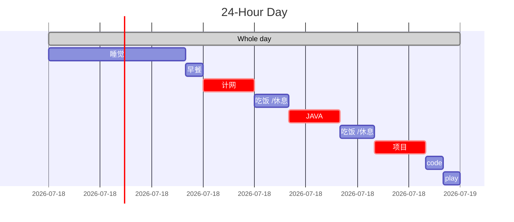

# 我的OFFER 之路

## ATTENTION

- ==录音录音！！！！==

  - > 已经将手机的来电设置成自动录音。

- ==发简历记得备注记录==

- ==面试结果给内推人说一声！！！==

- 仔细听题

- 直接在招聘官网注册账号可以查看详细的流程

面试前复习内容

- SQL
- 排序算法
- 计网HTTP和TCP/IP的内容
- 操作系统的一些算法。

## PLAN

- [ ] LEECODE 刷题

- [ ] 学习
  - [ ] 计算机网络
    - [ ] HTTP权威解读
    - [ ] TCP、IP详解
  - [ ] JAVA
    - [ ] 找个项目
    - [ ] JVM学习
  - [ ] 数据库
    - [ ] REDIS



## 记录

### 20201230 :star:Didi

滴滴——数据分析师实习生

10.30发的简历，以为没有下文了。因为投了好几个都没有下文。

居然在考完数据结构也就12.28号来了个电话，说这周面


面试过程：

腾讯会议，短暂的开了一会儿视频，还是我提的。

自我介绍完后就上来一道算法题：[Python——无序数组中找出和为N的两个数（三个数、四个数）](https://blog.csdn.net/zichen_ziqi/article/details/81417262)

然后就止步于此。


> 反思：
>
> 体验感极差，败在算法上。
>
> 本来可以场外求助的，就是上网搜索，结果我没有收到，我草，可恶的是他说结束后我再搜有他妈搜到了，太操蛋了。
>
> 其他的好像没有了，就像我考科二直接死在坡道一摸一样，唯一不一样的是科二还可以白嫖后面的场地。这个不行，面试的人话都不想和我说，直接就挂了。
>
> 还有这次的简历有点仓促，不是什么都投，我现在要**专注于后端JAVA的学习，必须刷leecode**。多刷才是唯一的道理。
>
> 有一些小细节还是没做好，pycharm关键时刻给我说注册码到期了，我很烦。面试自我介绍有点干，没有说的。

### 20210106

今天把简历改了，然后在河畔上投了一个师兄的邮箱，不知道有没有结果。

是字节跳动的。


也在牛客上投递了简历


### 20210108

记得那天是在图书馆的五楼过道上和BABY自习，然后接到了HR的电话。很是兴奋，约到了考试后的一个星期五（0122）


### 20210119

回来4天了，这几天都在看算法，但是早上试了一下模拟面感觉不大会说话了，吞吞吐吐的，还有两天，主要是复习然后看JAVAGUIDE里面的基础知识，还有数据结构的那些算法在看看，特别是排序算法。

- [ ] JAVA GUIDE
- [ ] 数据结构与算法
- [ ] Leecode 
  - [ ] 

### 20210122:star:Bytedance

字节面试

排序算法有哪些？

写快排

时间时间复杂度

输入网址后的过程

TCPIP协议稳定的

> 保证稳定性的机制有：
> 1.**校验和** 就是说咋数据传输的过程中 将发送的数据段映射为一个整数，然后加起来。发送方在发送数据之间计算校验和，然后接收方对收到的数据重新计算，与发送方进行对比。
> 2.TCP传输时将每个字节的数据都赋予了**序列号**，每次发送端发送数据，接收方会回一个ack报文，报文里面会带有确认序列号。然后发送方就知道哪些数据已经被接收，下次数据从哪里开始发送。如果有丢包，就重发。
> 3.而且针对丢包，TCP还有一种机制，叫**超时重传**，就是说发送方发完包没有得到回应，过段时间就会自动重新发送。
> 4.当网络阻塞的时候，传输的稳定性就很差，所以TCP有**拥塞控制**，就是用滑动窗口来来动态的控制每次发送的数据量。窗口的大小怎么设置？窗口的大小就是在无需等待确认包的情况下，发送端还能发送的最大数据量。

>  使用序号，对收到的TCP报文段进行排序以及检测重复的数据；使用校验和检测报文段的错误，即无错传输；使用确认和计时器来检测和纠正丢包或延时；流控制（Flow control）；拥塞控制（Congestion control）；丢失包的重传。


### 20210127


2月一号面试字节 冲冲冲！！！

### 20210201:star: Bytedance

自我介绍

聊天室项目要点

进程资源管理系统

==SQL 排名第二的姓名==  这个没写出来

> 解法1：
>
> >  select name from table order  by  sore desc LIMIT 1,1
> >
> >  limit 从第1个开始读，读一个，就是 2
>
> 解法2：
>
> > 假设有这样的一张表student：
> >
> > ```
> > name    mark
> > ---------------
> > Alice   98
> > Bob     67
> > Eric    75
> > Kato    84123456
> > ```
> >
> > 首先找到排名第一的学生，这一步没啥难度：
> >
> > ```sql
> > SELECT name, MAX(mark) as mark FROM student 1
> > ```
> >
> > 有了最高成绩了，那么次高成绩也就很容易搞定了，也就是把所有小于最高成绩的全部拿出来，然后再在这个范围内找出最高成绩，那就是次高成绩：
> >
> > ```sql
> > SELECT name, MAX(mark) AS mark
> > FROM student
> > WHERE mark < (SELECT MAX(mark) FROM student); 
> > ```

算法题 蛇形二叉树遍历

四次握手可以3次吗？

缓存了解吗？

硬盘了解吗？

问：

房租

职业规划

Waiting res 

------------------

下午接到阿里云块存储的面试电话

这次我约的是1月5号，也就是星期5中午。 

### 20210203

今天打了HR的电话，说的是在星期五或者星期日给结果

GOD　BLESS ME ! GOOD LUCKY ! :happy:

:four_leaf_clover:

今天学习SQL语句，这方面有点记不住。

### 20210204:unamused:

结果出来了，很遗憾又来了一次打击，最大的原因应该是SQL语句没有写出来。


------------------

心烦意乱，不知道要干什么:unamused:

我现在应该制定一个长期的学习计划，以应付如果没有找到实习的话可以后面一直找。

首先是复习巩固加深理解的计算机网络和操作系统，每天应该坚持刷Leecode。

计算机网络读《HTTP权威解读》

- 第一部分HTTP:Web的基础
- 第二部分HTTP结构
- 第三部分识别、认证与安全
- 第四部分实体、编码和国际化
- 第五部分内容发布与分发
- 第六部分附录

还有《TCP－IP详解》

然后是JAVA的深入学习，这里的学习线路应该是怎么样的呢？

JAVA应该看容器、JVM、并发、新特性

《深入理解JVM》

然后是数据库 MYSQL　＋　REDIS

spring boot :

https://github.com/Snailclimb/springboot-guide/blob/master/docs/start/springboot-introduction.md

javaguide

https://github.com/Snailclimb/JavaGuide/blob/master/docs/books/java.md

Linux

https://github.com/judasn/Linux-Tutorial/blob/master/markdown-file/Linux.md

### 20210205:star: Aliyun

阿里云面试一面

> 自我介绍
>
> 有公司实习经验吗？ 金惠家，为什么没有写在简历上，我觉得这次实习没有学到东西
>
> TCP和UDP的区别
>
> TCP为什么稳定
>
> 线程哪些资源可以共享，哪些不可以共享
>
> 常量怎么定义
>
> dinfine 和const的区别
>
> const的优点
>
> 了解hash吗
>
> hash冲突
>
> SQL     更新表 update  table  set   XX =XX where XX
>
> 有6个商品怎么避免被10个人购买。
>
> 回答是使用信号量+互斥锁     又问信号量的函数库是什么？不知
>
> 数据库本身是由锁的，不知道
>
> 编程题

```java
递增日期数组：
A=[2020-01-01, 2020-01-02, 2020-01-03, 2020-01-05, ..., 2020-02-01, ...]
一个黑名单日期段：
B=[[2020-01-01, 2020-01-03], [2020-02-10, 2020-02-16], ...]
求，去除黑名单中的日期段之后的可用日期是哪些？
public int[] black(int [] A,int [][] B)
{
 	/**
 	int len=0;
    //将B改成一维数组  
	int [] temp_b;
    for(int [] element :B)
    {
		len+=element.length;
    }
    temp_b= new int[len];
    int i=0;
    for (int [] arr :B)
    {
        for (int element:arr)
        {
        	temp_b[i++]=element;
        }
    }
    */
    //进行双指针处理
  	int len_a=A.length;
    int len=B.length;
  	i=0;
  	for(int j=0;j<len_a;j++)
    {
      if(A[j]>=B[i][0]&&A[j]<=B[i][1])
      {
        A=delete(A,j);
      }
      else if (A[j]>temp_b[i][1])
      {
        i++;
      }
      if(i>len)
        break;
    }
  	return A;
}
	private  int[] delete(int [] arr,int k)
	{
	    int len  = arr.length;
	    int[] temp_arr=new int [len-1];
	    for(int i=0;i<arr.length;i++)
	    {
	        if(i<k)
	            temp_arr[i]=arr[i];
	        if(i>k)
	            temp_arr[i-1]=arr[i];
	    }
	    return temp_arr;
	}
刚开始理解错了题意，以为是删除B中的元素，
思路是双指针，然后判断A中元素是否子B的范围里，在的话就删除
```

问：

技术栈： C底层　 JAVA系统　python运维

职业发展：　我回答是本科就业深耕技术，后面再去外国大学实验室学习

然后面试官由于有会议就离开了，等他消息

反思

C语言那一块答得不是很好，商品那个答得也不是太好


### 20210207

> **蚂蚁集团可信原生部实习生招聘，面向2021年12月-2022-10月期间毕业的同学。**  蚂蚁集团可信原生部，是服务于整个蚂蚁的基础设施平台，为蚂蚁全站提供稳定高效的底层设施建设和服务。 你将有机会面临下面的挑战： 1. 从事系统软件研发与研究，包括操作系统、安全计算技术、虚拟化、容器等。 2. 面向数百万容器场景，打造高效、职能、规模化的云原生基础设施资源调度平台。 3. 面向超大规模云原生平台，研发金融级、高性能、强安全的新一代云原生基础设施。包括容器存储、高并发网络系统、Service Mesh、云原生服务体系等。  或许，你来自计算机专业，机械专业，甚至可能是学生物的 但是，你酷爱着计算机以及互联网技术，热衷于解决挑战性的问题。 或许，你痴迷于数据结构和算法，热衷于ACM，常常为看到“accept”而兴奋的手足舞蹈；
或许，你熟悉Unix/Linux/Win32环境下编程，并有相关开发经验，熟练使用调试工具，并熟悉某种脚本语言；
或许，你熟悉网络编程和多线程编程，对TCP/IP，HTTP等网络协议有很深的理解；
或许，你享受底层技术，在kernel的源代码中纵横驰骋；
或许，你并不熟悉C，C++，但是你不畏挑战，喜欢钻研，能够用你亮眼的成果证明自己超强的学习能力；
或许，你参加过大学生数学建模竞赛，“挑战杯”，机器人足球比赛等；
或许，你在学校的时候作为骨干参与学生网站的建设和开发；
这些都是我们想要的。  我们希望你 1、快速学习，不断突破技术瓶颈，乐于探索未知领域，随时准备好去面对新挑战； 2、具备优秀程序员的基本素养，遇到问题可以一查到底，善用工具，对工程效率有自己的见解； 3、全栈式人才，在计算机系统结构、操作系统内核、网络、分布式系统、算法等领域有所专长相互融合； 4、对编程语言不封闭，有学习新语言的兴趣。  还在犹豫什么？我们期待着你的加入 ** 实习地：杭州、北京、上海、成都** 联系方式：[william.zk@antfin.com](mailto:william.zk@antfin.com)

### 20210209

没有把持的住，投了蚂蚁集团的简历。

### 20210215

年是过完了，但是这几天很是浮躁，学习学不进去，实习offer又还没有消息，真的太难了。

这几天还是要转变一下心态，产出一点内容来发布。

加油！

### 20210218

今天是初七，大家开始正式上班了。

早上 还在洗头就接到一个电话，是北京的，我以为是阿里云的二面来了，结果是另外一个部门。:unamused:.

然后约了23号也就是星期二早上10:30

等待确实很煎熬，但是要注意现阶段的目标是找到好的工作。所以还是要不断学习。

下午接到字节的安全开发的面试 定在 22号下午3点

加油！

### 20210222:star:Bytedance

下午3点


> 自我介绍
>
> 从进程资源管理器开始问
>
> 介绍项目，引了一个RR，然后进程调度有哪些？
>
> 再问进程调度系统的动作？
>
> 我说了一个中断，他追问是什么中断，太极拳
>
> 又问网络编程项目
>
> 数据库的问题：
>
> 怎么实现用户ID的（自增），那么怎么来解决多线程并发引起的冲突问题，加锁、设置数据库的隔离机制。类似于阿里云问的购物车的问题。
>
> selector（压中）
>
> 会线程编程吗
>
> HTTP格式
>
> TCP与UDP
>
> TCP为什么稳定？
>
> 怎么会导致重传？
>
> 三次握手
>
> 这里问了一个序列号的问题，连接之后序列号还会变吗
>
> 什么是面对对象？与 面向过程有什么好处？
>
> > **面向对象的三个基本特征是：封装、继承、多态**
> >
> > - 封装
> >
> >   封装最好理解了。封装是面向对象的特征之一，是对象和类概念的主要特性。封装，也就是把客观事物封装成抽象的类，并且类可以把自己的数据和方法只让可信的类或者对象操作，对不可信的进行信息隐藏。
> >
> > - 继承
> >
> >   继承是指这样一种能力：它可以使用现有类的所有功能，并在无需重新编写原来的类的情况下对这些功能进行扩展。通过继承创建的新类称为“子类”或“派生类”，被继承的类称为“基类”、“父类”或“超类”。
> >
> >   要实现继承，可以通过“继承”（Inheritance）和“组合”（Composition）来实现。
> >
> > - 多态性
> >
> >   多态性（polymorphisn）是允许你将父对象设置成为和一个或更多的他的子对象相等的技术，赋值之后，父对象就可以根据当前赋值给它的子对象的特性以不同的方式运作。简单的说，就是一句话：允许将子类类型的指针赋值给父类类型的指针。
> >
> >   实现多态，有两种方式，覆盖和重载。覆盖和重载的区别在于，覆盖在运行时决定，重载是在编译时决定。并且覆盖和重载的机制不同，例如在 Java 中，重载方法的签名必须不同于原先方法的，但对于覆盖签名必须相同
>
> 学过JAVA底层的一些知识吗？ｅｇ垃圾回收机制。没有:upside_down_face:
>
> 说了HASHMAP，和这么解决冲突的。
>
> Python是传参是值还是引用？ （脑抽答了值，应该是像JAVA一样传引用）
>
> 大数据的相关知识？这里说了数据预处理，和一些基本的算法决策树、KNN、K-Means 网络科学传染者模型，rankPage
>
> 问：
>
> 介绍一下该职位？
>
> 职业发展？
>
> 编程题：
> 合并数组

很多名词都搞忘了。其他答得还不错。

### 20210223:star: Aliyun

面试过程中收到上次面试的结果了:happy:


早上10点半

> 这次面试也很nice
>
> 自我介绍
>
> 直接上来就网路相关知识
>
> TCP三次握手和四次挥手，我说完三次握手就跳过了
>
> 数据库事务的特征ACID原子性，一致性，隔离性，持久性
>
> 操作系统通信有哪些：信号量、socket、管道（有名、无名）、共享内存。
>
> 编程题，二分查找的拓展题
>
> ```
> // 评测题目: 寻找第一个测试失败的commit
> 
> class Solution{
>   
>   private String findFirstBadCommit(String[] commits) {
>     int left=0;
>     int right=commits.length-1;
>     int mid;
>     int res=-1;
>     while(left<=right)
>     {
>       mid=left+(right-left)/2;
>       if(idBad(commits[mid])==true)
>       {
>         res=mid;
>         right=mid-1;//锁定右侧边界
>         // mid 是bad1 那么[l,r]不含bad，不会进入该条件，res就是bad1
>         // mid 不是bad1,那么[l,r]含有bad,还会进入该条件，res会改变。
>       }
>       else
>       {
>         left=mid+1;
>       }
>     }
>     if(res!=-1)  return commits[res];
>     else return null;
>   }
> 	
>   //return true if commit is bad
>   // isBad true
>   private boolean isBad(String commit){
>     
>   }
>   
> }  
> 
> // input: ["good1", "good2", "good3", "bad1", "bad2", "bad3"] output: "bad1"
> // input: ["bad1","bad2"]  output:"bad1"
> // input: ["good1"] output: null
> // input: [] output:null
> // input: [g g b1 b ]  l=0 r=3 m=1,l=2, r=3 m=2,r=1  output b1  res=2
> // input: [g g g b1 ]
> // input: [g g b1 b b]
> // input: [g g g b1 b]
> ```
>
> 面试官一直再强调测试用例的数量，我先想到全是g,b,或者null,但是面试官又说还有他们数量的不同也算。
>
> ==记得注释==，这样就可以避免今天出现的情况了。

### 20210224:star:Tencent

下午四点


> 面经：
>
> 自我介绍
>
> 输入网站的过程
>
> TCP三次握手
>
> 服务端怎么身份识别-》cookie,session
>
> 如果客户端不保存cookie，那么怎么来验证呢？ 这里没有绕过弯，**可以将session_id添加到URL里面**
>
> 什么协议使用UDP：
>
> 网络并发：selector、poll、epoll
>
> 问了一下epoll的底层实现？不知
>
> 怎么处理网络编程并发效果没有达到预期效果？eg:使用selector来写服务器，理论上可以并发200,结果只能并发100。怎么来找问题？
>
> > 我的回答是使用Debug，然后将全部过程走一遍。
> >
> > 面试官说比如经常使用的CPU性能使用情况，ping,网络带宽情况等等
>
> 进程与线程的区别
>
> 什么是线程不安全？
>
> > > **线程安全**就是多线程访问时，采用了加锁机制，当一个线程访问该类的某个数据时，进行保护，其他线程不能进行访问直到该线程**读/写**完，其他线程才可使用。不会出现数据不一致或者数据污染。
> >
> > > **线程不安全**就是不提供数据访问保护，有可能出现多个线程先后更改数据造成所得到的数据是脏数据。
> >
> > 简书，努力的橘子，https://www.jianshu.com/p/51c7f61120fc
>
> 怎么来实现线程安全？ 我说使用锁
>
> ==自旋锁==了解吗？
>
> > 
>
> 进程之间的通信，信号量、管道、scoket、共享内存
>
> 这里问了他们的特点，没有了解，再看看。
>
> > 1. 管道：速度慢。容量有限，仅仅有父子进程能通讯
> > 2. FIFO：不论什么进程间都能通讯，但速度慢
> > 3. 消息队列：容量受到系统限制，且要注意第一次读的时候，要考虑上一次没有读完数据的问题
> > 4. 信号量：不能传递复杂消息，仅仅能用来同步
> > 5. 共享内存区：能够非常easy控制容量，速度快，但要保持同步，比方一个进程在写的时候。还有一个进程要注意读写的问题，相当于线程中的线程安全。当然。共享内存区相同能够用作线程间通讯，只是没这个必要，线程间本来就已经共享了同一进程内的一块内存
> >
> > https://www.huaweicloud.com/articles/97fdf513dbf7aeaeebd79612f5cca375.html
>
> 有没有无锁的方案来实现并发？ 原语
>
> 死锁是什么？
>
> 问的是什么情况产生死锁？这里问的是必要条件，但是要举例子，难顶！
>
> > - 互斥条件：一个资源每次只能被一个进程使用，即在一段时间内某 资源仅为一个进程所占有。此时若有其他进程请求该资源，则请求进程只能等待。
> > - 请求与保持条件：进程已经保持了至少一个资源，但又提出了新的资源请求，而该资源 已被其他进程占有，此时请求进程被阻塞，但对自己已获得的资源保持不放。
> > - 不可剥夺条件:进程所获得的资源在未使用完毕之前，不能被其他进程强行夺走，即只能 由获得该资源的进程自己来释放（只能是主动释放)。
> > - 循环等待条件: 若干进程间形成首尾相接循环等待资源的关系
>
> 面对对象的特点，多态的一些概念，这里答得不是很好。
>
> malloc与new的区别？
>
> > |         特征         |              new/delete               |             malloc/free              |
> > | :------------------: | :-----------------------------------: | :----------------------------------: |
> > |    分配内存的位置    |              自由存储区               |                  堆                  |
> > | 内存分配成功的返回值 |             完整类型指针              |                void*                 |
> > | 内存分配失败的返回值 |             默认抛出异常              |               返回NULL               |
> > |    分配内存的大小    |       由编译器根据类型计算得出        |          必须显式指定字节数          |
> > |       处理数组       |       有处理数组的new版本new[]        | 需要用户计算数组的大小后进行内存分配 |
> > |   已分配内存的扩充   |            无法直观地处理             |         使用realloc简单完成          |
> > |     是否相互调用     | 可以，看具体的operator new/delete实现 |             不可调用new              |
> > |  分配内存时内存不足  | 客户能够指定处理函数或重新制定分配器  |       无法通过用户代码进行处理       |
> > |       函数重载       |                 允许                  |                不允许                |
> > |  构造函数与析构函数  |                 调用                  |                不调用                |
> >
> > 来源： https://www.cnblogs.com/qg-whz/p/5140930.html
>
> 地址由低到高
>
> 代码区-》全局变量区-》堆-》栈
>
> > 
> >
> > 　　　　　　　　　　图源：http://c.biancheng.net/cpp/html/2857.html
>
> hashmap底层使用的是什么数据结构，链表？
>
> TLS库里的类什么时候能使用并发？
>
> 快排？
>
> 排序算法有哪些？
>
> 数据库
>
> ACID
>
> 事务的隔离详细
>
> 编程：
>
> > 两数之和尽量接近于K
> >
> > 写完整的代码！!


### 20210226:star:Bytedance推迟

早上收到腾讯的复试消息，定在3月1号晚上7点。

> 

面试由于面试官在开会被推迟，推到3.2下午2点开始。

### 20210228

到校的第一天，明天就是面腾讯的二面，这是第一个二面，必须成功！

今天下午去机场接宝贝，然后晚上就看内容复习，准备面试。

:facepunch:

面对对象的内容特别是C++的看一下，然后是复习其他的内容。

### 20210301:star2:Tencent

> 自我介绍
>
> 然后代码题，如下，一脸懵逼，说了访问变量可能会出现错误，这里应该要加互斥锁。

```C++
这段代码假设用于多线程高负载高性能场景下，程序内请求和响应量的统计，会被大量调用，请找出下面代码的问题并改正。
class TrafficStats 
{
public:
    TrafficStats() {
        requestCount = 0;
        responseCount = 0;
    }

    static TrafficStats getInstance() {
        if (singleton == null) {
            singleton = new TrafficStats();
        }
        return singleton;
    }

    void countRequest(int num) {
        requestCount += num;
    }

    void countResponse(int num) {
        responseCount += num;
    }

private:
    static TrafficStats *singleton;
    int requestCount;
    int responseCount;
}
```

一个int数，通过n++、n--、n为偶数的时候n/2变为1，最少需要多少步

```C++
#include <iostream>
using namespace std;


int step(int k)
{
    if(k<=1) return 0;
    int res[k+1];
    res[0]=0;
    res[1]=0;
    for(int i=2;i<=k;i++)
    {
        if(i%2==0)
        {
            res[i]==res[i/2]+1;
        }
        else{
            res[i]=min(res[(i+1)/2],res[(i-1)/2])+2;
        }
    }
    return res[k];
}
int main() {
    int a;
    cin >> a;
    int res=step(a);
    cout << res<< endl;
}


int cal(int num)
{
    int count = 0;
    int dst = num;
    
    while (dst != 1)
    {
        if (dst % 2 == 0)
        {
            count++;
            dst = dst / 2;
        }
        else
        {
            int higher = dst + 1;
            int lower = dst - 1;
            
            int higher_rst = cal(higher);
            int lower_rst = cal(lower);
            
            if (higher_rst >= lower_rst)
            {
                dst--;
                count++;
            }
            else
            {
                dst++;
                count++;
            }
        }
    }
    
    return count;
}
```

项目讲解：面试官问了进程资源管理系统的这个项目

想让我讲解

面向对象的可拓展性？继承、接口、覆盖、重载

学过设计模式吗

JAVA的框架有了解吗？ 说了SPRING框架

有用过其他库吗，或者是组件吗？ 没有

LINUX：

进程状态有哪些，我说了挂起那个

什么条件会阻塞会挂起

linux怎么对内存进行管理的

想杀掉进程，怎么和进程进行通信的？不太懂，说了进程之间的通信

最后问了算法题

一个random函数可以产生1-6的随机数，请产生1-12的随机数，1-13呢？

```
if(random()>3)
{
	random()+6;
}
else
{
	random();
}
1-13没有想出来
面试官说
可以类似于两个骰子，进行排序组合。
一共有36种组合，然后只选1-13，超过13就重新来。

我现在有个想法就是6进制，0-5，不就是6进制吗！
```


### 20210302:star:Bytedance

自我介绍+手撕代码

string ConvertNum( string src, int src_base , int dst_base)

example:

("FF",16,10) = "255"

("077",8,10) = "63"

("10",16,10) = "16"

assume:

src_base/dst_base= 2,8,10,16

src >="0"

假设没有任何前缀；

假设参数都正确

假设参数都是非负数

```C++
#include <stdio.h>

void ConvertNum(char *dest,char *src,int m,int n)
{
    char ch,*p=dest;
    int i=0;
    //转为10进制 
    while(*src)
    {
        if(*src>='a'&&(*src<='f')) 
        {
            i=i*m+*src-'a'+10;
            src++;
        }
        else i=i*m+*src++ -'0';
    }
    //转为n
    while(i) {
        *dest++=i%n+'0';
        i=i/n;
    }
    //\0
    *dest='\0';
    dest--;
    while(p< dest)
    {
        ch=*dest;
        *dest=*p;
        *p=ch;
        p++;
        dest--;
    }
}

int main(){
    char res[100];
    ConvertNum(res,"ff",16,10);
    printf(res);
    return 0;
}
```

比面腾讯还离谱，写完代码就走了。

投了阿里巴巴，想修福报！:ok_hand:


### 20210303:star2:Aliyun

阿里巴巴淘宝事业部打来电话相约面试，结果因为阿里云，就后续联系了。

晚上7点

> 编程题：

> ```java
> public class ListNode{
> 	int val;
> 	ListNode  next;
> }
> 
> List deleteNode(ListNode head,int n)
> {
>   ListNode p=head;
>   ListNode q=head;
>   for (int i=0;i<n;i++)
>   {
>     if(p==null) return head;
>   	p=p.next;
>     
>   }
>   if(p==null)
>   {
>     head=head.next;
>     return head;
>   }
>   while(p.next!=null)
>   {
>   	p=p.next;
>     q=q.next;
>   }
>   q.next=q.next.next;
>   return head;
> }
> 
> 
> ---
>   Given a list of integers. find out the maximum gap where the right number is bigger than the left number.
> These two numbers are not necessarily neighgours.
> For example,
>     10 12 15 9 8 7 10 13 11
> return: 6
> 
> int maxDiff(int [] arr)
> {
>   int n=arr.length;//9
>   int min_i=arr[0];//10
>   int max_diff=arr[1]-arr[0];//2
>   for (int i=2;i<n;i++)
>   {
>     if(arr[i-1]<min_i)  min_i=arr[i-1];
>     if(arr[i]-min_i>max_diff)max_diff=arr[i]-min_i;
>   }
>   return max_diff;
> }
> 
> ---
> 给一个二叉树，计算树的最大宽度
>         A 
>     B       C
>  D     E   F   G 
> H     I J   K    L
> 
> class MaxWidth
> {
>   public int width2(TreeNode root)
>   {
>     if(root==null) return 0;
>     Queue<node> q=new LinkList<TreeNode>();
>     q.add(root);
>     int res=1;
>     int l=1;
>     while(q.size()>0)
>     {
>       while(l>0)
>       {
>         TreeNode node=q.poll();
>         if(node.lchild!=null)
>         {
>           q.add(node.lchild);
>         }
>         if( node.lchild!=null)
>         {
>           q.add(node.lchild);
>         }
>         l--;
>       }
>       l=q.size();
>       res=Math.max(res,q.size());
>     }
>     return res;   
> }
> ```
>
> 

过几天来问面试结果，后续可能还有面试！

### 20210304:sparkles:A​liyun

11点下完课，在看Quora,电话铃声没开

看着看着注意到手机有电话接入，接听

是阿里云块存储的，约今天下午两点15面试  💪


### 20210312:star:Tencent

2021-03-12 10:00

## 问题整理

- [ ] 培养计划
- [ ] 技术栈，需要学习哪些方面的知识？
- [ ] 职业规划
- [ ]   \1. 公司对这个岗位的期望是什么样的？其中，哪些部分是我需要特别努力的？
    \2. 公司是否有正式或非正式培训？
    \3. 公司的升迁渠道如何？
    \4. 公司是否有外派或轮调的机会？
    \5. 是否有资深的人员能够带领新进者，并让新进者有发挥的机会？
    \6. 公司强调团队合作。那在这个工作团队中，哪些个人特质是公司所希望的？
    \7. 公司是否鼓励在职进修？对于在职进修是否有补助？
    \8. 能否为我介绍一下工作环境，或者我是否有机会能参观一下贵公司？

## 书单

《Java 核心技术卷 1/2》《Head First Java》  适合新手

《Effective Java》、《重构》 这个是编程思想

计算机网络

《HTTP权威解读》、《TCP、IP详解》

数据结构与算法

《剑指 offer》 、《编程珠玑》 、《编程之美》

# 2021计划

- [ ] 找到实习岗位
- [ ] 理想工作
- [ ] 换Iphone
- [ ] 娱乐
  - [ ] 跑跑卡丁车
  - [ ] 雪山

# 实习信息

> hello~需要内推的同学可以发简历到 [tracycui@futunn.com](mailto:tracycui@futunn.com) 1. 注明【春招实习】 2. 选择的岗位名称  工作地点：深圳   **春招实习.jpg** *(261.02 KB, 下载次数: 0)*[下载附件](https://bbs.uestc.edu.cn/forum.php?mod=attachment&aid=MjAyMTU2MHw3YWZiNmNkY3wxNjEzMzc1Mjg3fDIxODM2M3wxODQwNzg5&nothumb=yes) [保存到相册](javascript:;)6 天前 上传


## tencent

https://join.qq.com/

